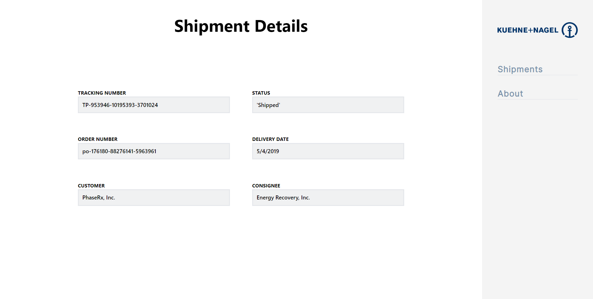

# Getting Started with Create React App

This project was bootstrapped with [Create React App](https://github.com/facebook/create-react-app).

## How to use
1. `npm install`
3. `npx vite` - to run it on [localhost:3000](localhost:3000)

## Tech used
This simple app was built using __React, React-router, Redux, Vite, WindiCSS__ with __Javascript__ as the primary language and __Axios__ for API fetching

## Screenshots

